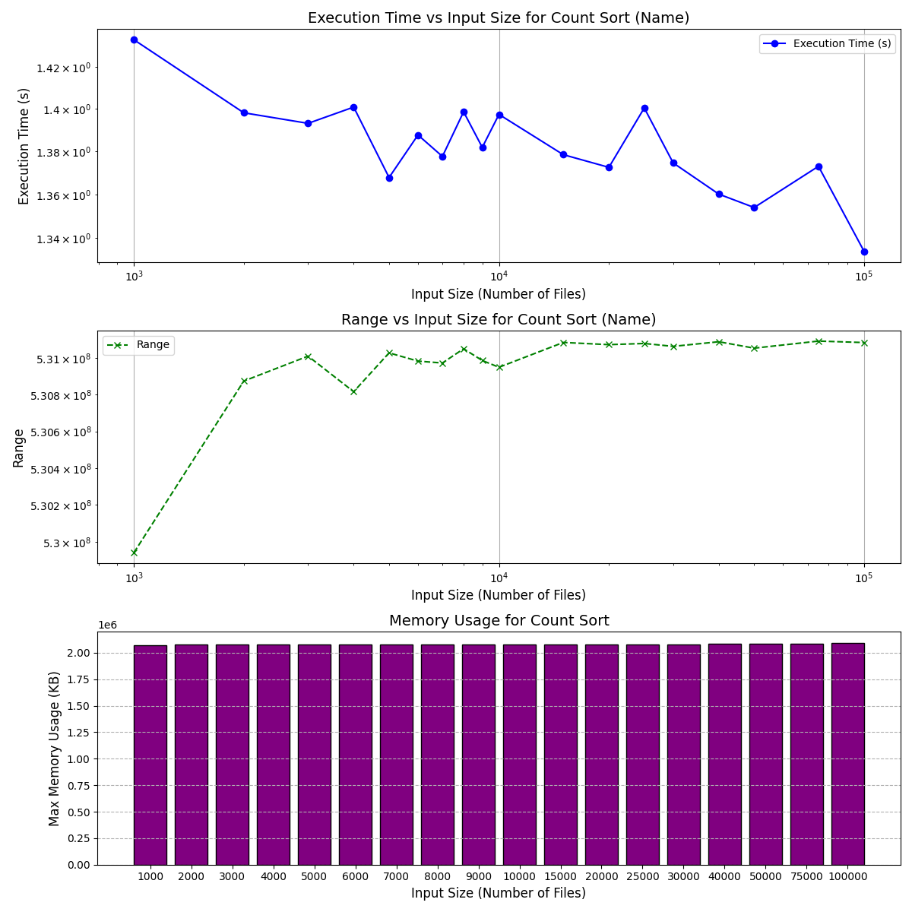

# **SortSync**


## *Project Title:*  ***Implementation of Parallel Sorting Algorithms***

### *Author: Shreyas Mehta IIIT-H*


## Description
- This project aims to implement and compare the performance of various sorting algorithms, including `Merge Sort`, `Count Sort`, and their parallel versions, using `POSIX threads` for parallelization.
- The program reads file data, sorts the files based on different criteria (`name`, `ID`, `timestamp`), and outputs the sorted files along with `performance metrics`.
- Created a `test case generator` to generate test cases for sorting algorithms.
- The project includes functions for `file handling`, `sorting`, `counting`, and `parallel processing` to optimize the sorting process.
- Creation of a `Makefile` for building and managing the project.
- Implementing different kinds of `hashing functions` for sorting the files.
- The project includes a `shell script` for measuring the performance of sorting algorithms.
- Checked `time complexity` of the sorting algorithms.
- This project is a part of the `Operating Systems and Networks` course at `IIIT-Hyderabad`.

## Files and Directories
```
.
├── Makefile                      # The makefile used to build and manage the project
├── main.c                        # Main entry point of the program
├── file_info.c                   # Source code handling file-related data and structures
├── parallel_merge_sort.c         # Parallel Merge Sort algorithm implementation
├── merge_sort.c                  # Regular Merge Sort algorithm implementation
├── parallel_count_sort.c         # Parallel Count Sort algorithm implementation
├── count_sort.c                  # Regular Count Sort algorithm implementation
├── parallel_merge_sort.h         # Header file for parallel merge sort
├── file_info.h                   # Header file defining the file structure
├── parallel_count_sort.h         # Header file for parallel count sort
└── count_sort.h                  # Header file for count sort
├── a.out                         # Executable file generated after compiling
├── a_usage.txt                   # Usage instructions for running the compiled executable
├── check.txt                     # Example test case file for checking sorting algorithms
├── file_info.c                   # Source code for file-related operations (duplicate file)
├── graphs                        # Folder containing graph images related to performance comparisons
├── main_usage.txt                # Main program usage instructions
├── measure.sh                    # Shell script for measuring performance of sorting algorithms
├── myenv                          # Environment setup script or configuration file
├── output                         # Directory for storing output files
├── parallel_merge_sort.h          # Header file for parallel merge sort (duplicate file)
├── readme.md                      # Project README file (this file)
├── results                        # Folder for storing the results of sorting operations
├── test                           # Folder for test-related files and data
├── test_case_count_10.txt         # Example test case file for 10 items to be sorted
├── test_case_count_final.txt      # Example test case file for final count sort test case
├── test_case1.txt                 # Example test case file
├── test_case_count.txt            # Test case file for count sort
├── test_case_count_final.txt      # Final test case for count sort (duplicate file)
├── test_result.txt                # File to store the result of test execution
├── testcasegenerator.c            # C file for generating test cases
├── test_case_4.txt                # Test case file for testing sorting algorithms with 4 elements
├── temp.txt                       # Temporary file used during program execution
└── test_usage.txt                 # Test case usage instructions
```


### How to Run the Program

1. **Compile the Program**:
   To compile the program, run the following command in the terminal, replacing `Threads` with the desired number of threads and `threshold` with the threshold value:
   bash
   make clean; make NUMBER_OF_THREADS=4 TEST=true THRESHOLD=10000
   
   - **`NUMBER_OF_THREADS=4`**: Sets the number of threads for parallel sorting.
   - **`TEST=true`**: Enables performance testing mode.
   - **`THRESHOLD=10000`**: Sets the threshold value for switching between sorting algorithms.

2. **Run the Program**:
   After compilation, run the program with:
   bash
   ./main
   
   or 
    bash
    ./measure.sh ./main
    
   - Follow the prompts to input the number of files, sorting criteria, and file data.

3. **View Results**:
   The program will display the sorted files and performance metrics (e.g., sorting time and speedup for parallel sorting).


### Functions Used

#### `file_info.c`:

- `compareByName`: Compares two `FileInfo` structures by the `name` field.
- `compareById`: Compares two `FileInfo` structures by the `fileId` field.
- `compareByTimestamp`: Compares two `FileInfo` structures by the `timestamp` field.
- `printFileInfo`: Prints the details of a `FileInfo` structure.
- `mallocWrapperForFile`: Allocates memory for an array of `FileInfo` structures.
- `printFiles`: Prints the details of all `FileInfo` structures in the provided array.
- `comparebyNameCount`: Compares two `FileInfo` structures by the `name` field in a case-insensitive manner.

---

| **Function Name**            | **Description**                                                                                              | **Error Handling**                                             | **Memory Management**                                           |
|------------------------------|--------------------------------------------------------------------------------------------------------------|---------------------------------------------------------------|-----------------------------------------------------------------|
| `compareByName`               | Compares two `FileInfo` structures by the `name` field. Returns a negative, zero, or positive value based on the comparison. | No explicit error handling. Assumes valid `FileInfo` objects. | No dynamic memory allocation.                                   |
| `compareById`                 | Compares two `FileInfo` structures by the `fileId` field. Returns a negative, zero, or positive value based on the comparison. | No explicit error handling. Assumes valid `FileInfo` objects. | No dynamic memory allocation.                                   |
| `compareByTimestamp`          | Compares two `FileInfo` structures by the `timestamp` field. Parses the timestamp strings into `tm` structures, converts to `time_t` values, and compares them. | Prints an error message if timestamps can't be parsed. Returns 0 if there is an error parsing the timestamp. | No dynamic memory allocation.                                   |
| `printFileInfo`               | Prints the details of a `FileInfo` structure (name, fileId, and timestamp).                                   | No error handling. Assumes valid `FileInfo` structure.         | No dynamic memory allocation.                                   |
| `mallocWrapperForFile`        | Allocates memory for an array of `FileInfo` structures based on the specified number of files. Returns a pointer to the allocated memory. | If memory allocation fails, prints an error message and exits the program. | Dynamically allocates memory for the `FileInfo` array. Caller must free the memory after use. |
| `printFiles`                  | Prints the details of all `FileInfo` structures in the provided array.                                         | No error handling. Assumes valid pointer to `FileInfo` array.  | No dynamic memory allocation.                                   |
| `comparebyNameCount`          | Compares two `FileInfo` structures by the `name` field in a case-insensitive manner. Returns a negative, zero, or positive value based on the comparison. | No explicit error handling. Assumes valid `FileInfo` objects. | No dynamic memory allocation.                                   |


### Structs and Function Definitions in `file_info.h` and `file_info.c`

#### 1. **Struct Definition**: `FileInfo`

In the header file `file_info.h`, we define a structure called `FileInfo`, which represents information about a file. The structure is defined as follows:

c
typedef struct {
    char name[50];          // The name of the file (up to 50 characters)
    int fileId;             // Unique identifier for the file
    char timestamp[20];     // Timestamp associated with the file in string format (e.g., "2024-11-10T14:30:00")
    int fileHash;           // A hash value representing for sorting the files on the basis of name and timestamp
} FileInfo;


---

### `merge_sort.c`:

- **`merge_sort`**:  
  - **Definition**: Recursively sorts an array using the merge sort algorithm.  
  c
  void merge_sort(FileInfo *arr, int left, int right, int (*cmp)(const FileInfo *, const FileInfo *));
    
  - **Description**: This function recursively splits the array into smaller subarrays, sorts them, and merges them back together using the `mergeArrays` function.

- **`mergeArrays`**:  
  - **Definition**: Merges two sorted arrays into a single sorted array.  
  c
  void mergeArrays(FileInfo *arr, int left, int mid, int right, int (*cmp)(const FileInfo *, const FileInfo *));
    
  - **Description**: This function merges two sorted subarrays (`left` to `mid` and `mid+1` to `right`) into a single sorted array by comparing elements using the provided comparison function (`cmp`).


### `count_sort.c`:

- **`count_sort_by_id`**:  
  - **Definition**: Sorts an array of `FileInfo` structures based on the `fileId` field using the counting sort algorithm.  
  c
  void count_sort_by_id(FileInfo *files, int num_files);
    
  - **Description**: This function counts occurrences of each `fileId`, calculates start positions, and builds a sorted array of `FileInfo` structures based on the `fileId` values.

- **`hash_name_regular`**:  
  - **Definition**: Generates a hash value for the `name` field of a `FileInfo` structure using a custom hashing algorithm.  
  c
  int hash_name_regular(char *key);
    
  - **Description**: This function computes a hash value for the `name` by converting characters to lowercase and performing mathematical operations to create a unique hash.

- **`count_sort_by_name`**:  
  - **Definition**: Sorts an array of `FileInfo` structures based on the `name` field using counting sort, after generating a hash for each name.  
  c
  void count_sort_by_name(FileInfo *files, int num_files);
    
  - **Description**: This function uses the `hash_name_regular` function to generate hashes for the `name` field of each `FileInfo`, and then sorts the array based on these hash values using the counting sort algorithm.

- **`convert_timestamp_to_epoch_regular`**:  
  - **Definition**: Converts a timestamp string (e.g., "2024-11-10T14:30:00") to epoch time (seconds since January 1, 1970).  
  c
  time_t convert_timestamp_to_epoch_regular(const char *timestamp);
    
  - **Description**: This function uses `strptime` to parse the timestamp and `mktime` to convert it to epoch time, returning the corresponding `time_t` value.

- **`count_sort_by_timestamp`**:  
  - **Definition**: Sorts an array of `FileInfo` structures based on the `timestamp` field using counting sort, after converting each timestamp to epoch time.  
  c
  void count_sort_by_timestamp(FileInfo *files, int num_files);
    
  - **Description**: This function first converts the `timestamp` field of each `FileInfo` to epoch time using `convert_timestamp_to_epoch_regular`, and then sorts the array based on these epoch values using the counting sort algorithm.

### `parallel_merge_sort.c`:

### **Explanation of Logic**

The code implements a **parallel merge sort** algorithm using **POSIX threads** (`pthread`). It optimizes the standard merge sort by utilizing multiple threads to recursively sort subarrays concurrently. Let's break down the key components and logic:

### **Key Components**:

1. **`merge` Function**:
   - This function merges two sorted halves of an array into one sorted array.
   - It takes an array (`files`), indices `left`, `mid`, and `right`, and a comparison function `cmp` to compare `FileInfo` structures.
   - The two halves of the array are merged into a temporary array (`result`), and after merging, the results are copied back to the original array.

2. **`recursive_sort` Function**:
   - This is the recursive function responsible for sorting the array.
   - **Base Condition**: If the size of the subarray is below a threshold (`_THRESHOLD_`), it switches from parallel recursion to sequential sorting using `merge_sort` (a standard merge sort function). This prevents unnecessary thread creation for small subarrays, which could actually harm performance due to the overhead of thread creation.
   - **Parallel Sorting**: If the subarray size is above the threshold, two threads are created to sort the left and right halves of the array concurrently. The threads are joined (waited for completion), and then the results are merged.
   - **Depth Tracking**: The `depth` variable tracks the recursion depth. Each time the function recurses, it increments the depth. The maximum depth is recorded using a mutex (`depth_mutex`) to prevent race conditions.

3. **`parallel_merge_sort` Function**:
   - This function serves as the entry point to initiate parallel merge sort. It sets the threshold for switching between parallel and sequential sorting based on the array size (`_THRESHOLD_`).
   - It checks for an invalid array size (less than or equal to 0) and sets the threshold based on the size of the array.
   - It then calls the `recursive_sort` function to start the parallel merge sort process.

### **Flow of Execution**:

1. **Initialization**:  
   The `parallel_merge_sort` function is called with an array of `FileInfo` objects (`files`), its size (`size`), and the comparison function (`cmp`). The threshold `_THRESHOLD_` is set to a fraction of the array size, where the larger the array, the larger the threshold before switching to parallel sorting.

2. **Recursive Sorting (Multithreading)**:
   - The `recursive_sort` function is called with initial values: left index `0`, right index `size - 1`, and depth `0`.
   - **Base Case**: If the size of the array (difference between `left` and `right`) is less than `_THRESHOLD_`, the function performs a standard merge sort without creating threads. This is done by calling the `merge_sort` function.
   - **Recursive Case (Parallel Sorting)**: If the size of the array is greater than the threshold, the array is divided into two halves:
     - A new thread (`leftThread`) is created to sort the left half.
     - A new thread (`rightThread`) is created to sort the right half.
     - Both threads are joined using `pthread_join`, ensuring that the sorting of both halves completes before the merge step.
   - The merge step is then called to combine the sorted halves into a single sorted array.

3. **Depth Tracking**:  
   The maximum recursion depth is tracked and updated using a mutex (`depth_mutex`) to ensure thread safety when multiple threads are working concurrently. The maximum depth value is printed after the sorting is complete.

4. **Threshold Mechanism**:  
   - If the size of the array is small (below `_THRESHOLD_`), it switches to a non-parallel merge sort (standard `merge_sort`).
   - If the size of the array is large enough, it recursively divides the array into smaller subarrays and sorts them in parallel using threads. The choice of `_THRESHOLD_` is crucial as it decides when the overhead of thread creation outweighs the benefits of parallel execution.

5. **Mutex Protection**:  
   The `max_depth` variable tracks the maximum recursion depth. Since multiple threads may access this variable concurrently, it is protected by a mutex (`depth_mutex`). This ensures that only one thread updates the `max_depth` at a time.

### **Summary of Parallel Merge Sort Logic**:

- **Parallel Sorting**: It recursively divides the array and sorts each subarray concurrently using threads until the subarray size is small enough to be sorted using a regular merge sort (threshold determined by `_THRESHOLD_`).
- **Merge Step**: After sorting the left and right halves (either sequentially or in parallel), the results are merged.
- **Depth Tracking**: The maximum depth of recursion is tracked and output at the end to understand how deep the recursive tree was.
- **Threshold**: The threshold is dynamically calculated based on the array size to decide when to stop using threads and use regular merge sort.

### **Example of Thread Behavior**:
1. **Initial Call**: `parallel_merge_sort` is called with the entire array.
2. **Divide and Conquer**: The array is divided recursively into subarrays, and each recursive call creates two threads to sort the left and right halves in parallel.
3. **Merging**: After the recursive threads finish, the sorted subarrays are merged back together, leading to the final sorted array.

### **Threshold Adjustment**:
- The threshold (`_THRESHOLD_`) plays a key role in optimizing the sorting. If set too high, there may be unnecessary parallelization overhead. If set too low, the program may miss out on the benefits of parallel execution.
  

### `parallel_merge_sort.c`:

- **`merge`**:  
  - **Definition**: Merges two sorted subarrays into one sorted array.  
  c
  void merge(FileInfo *files, int left, int mid, int right, int (*cmp)(const FileInfo *, const FileInfo *));
    
  - **Description**: This function takes in an array (`files`), two indices defining the subarrays (`left`, `mid`, `right`), and a comparison function (`cmp`). It merges the two sorted halves of the array into a single sorted array and copies the result back into the original array.

- **`recursive_sort`**:  
  - **Definition**: Recursively sorts a subarray using threads, implementing the parallel merge sort algorithm.  
  c
  void *recursive_sort(void *args);
    
  - **Description**: This function recursively sorts the `files` array between indices `left` and `right`. If the subarray size is below the threshold, it switches to sequential merge sort. Otherwise, it creates two threads to sort the left and right halves in parallel. It updates the maximum depth of the recursion tree using a mutex to ensure thread-safe access.

- **`parallel_merge_sort`**:  
  - **Definition**: Initiates the parallel merge sort on the `files` array with the given comparison function.  
  c
  void parallel_merge_sort(FileInfo *files, int size, int (*cmp)(const FileInfo *, const FileInfo *));
    
  - **Description**: This function initializes the threshold for parallel sorting based on the array size and calls `recursive_sort` to start the parallel merge sort process. It also handles edge cases where the array size is invalid. The function prints the maximum recursion depth if the `TEST` flag is set.

- **Threshold Calculation**:  
  - **Definition**: Calculates the threshold for switching from parallel to sequential sorting.  
  c
  THRESHOLD = 3 * size / 16;
    
  - **Description**: The threshold for switching to sequential merge sort is set as a fraction (3/16) of the array size. This ensures that smaller subarrays are sorted using a regular merge sort rather than creating unnecessary threads for small subarrays.

- **Depth Tracking (Mutex)**:  
  - **Definition**: Tracks and updates the maximum recursion depth using a mutex to prevent race conditions.  
  c
  pthread_mutex_lock(&depth_mutex);
  if (depth > max_depth) {
      max_depth = depth;
  }
  pthread_mutex_unlock(&depth_mutex);
    
  - **Description**: A mutex (`depth_mutex`) is used to synchronize access to the `max_depth` variable, which tracks the deepest level of recursion. This ensures that the maximum depth is updated safely even when multiple threads are accessing the variable concurrently.


### `parallel_count_sort.c`:

- **`count_frequency_by_id`**:  
  - **Definition**: A helper function that counts the frequency of `fileId` values in a specific range for a given thread.  
  c
  void *count_frequency_by_id(void *arg);
    
  - **Description**: This function is executed by each thread. It allocates a local frequency count array, iterates over a portion of the `files` array, and counts occurrences of `fileId` in the specified range. The results are stored in the `local_counts` array for later aggregation.

- **`parallel_count_sort_by_id`**:  
  - **Definition**: Sorts an array of `FileInfo` structures based on the `fileId` field using a parallel counting sort approach with multiple threads.  
  c
  void parallel_count_sort_by_id(FileInfo *files, int num_files);
    
  - **Description**: This function divides the work of counting `fileId` frequencies across multiple threads, where each thread works on a portion of the `files` array. It then aggregates the results and uses a prefix sum to build a sorted array of `FileInfo` structures based on the `fileId`. The sorted data is copied back to the original `files` array.

- **`count_frequency_id_sync`**:  
  - **Definition**: A helper function for counting the frequency of `fileId` values using atomic operations for thread-safe updates.  
  c
  void *count_frequency_id_sync(void *arg);
    
  - **Description**: This function is executed by each thread. It counts the occurrences of `fileId` for each file in the assigned portion of the array using `__sync_fetch_and_add` to ensure thread safety when updating the global `count` array.

- **`parallel_count_sort_by_id_sync`**:  
  - **Definition**: Sorts an array of `FileInfo` structures based on the `fileId` field using parallel counting sort with atomic operations to ensure synchronization across threads.  
  c
  void parallel_count_sort_by_id_sync(FileInfo *files, int num_files);
    
  - **Description**: Similar to `parallel_count_sort_by_id`, but instead of local arrays for each thread, it uses atomic operations to update the global `count` array. It calculates the cumulative count using prefix sum, then sorts the files based on `fileId` and copies the sorted data back into the original array.

- **`convert_timestamp_to_epoch`**:  
  - **Definition**: Converts a timestamp string (e.g., "2024-11-10T14:30:00") into epoch time (seconds since January 1, 1970).  
  c
  time_t convert_timestamp_to_epoch(const char *timestamp);
    
  - **Description**: This function uses `strptime` to parse the timestamp into a `tm` structure and `mktime` to convert it into epoch time. It returns the epoch time as a `time_t` value.

- **`count_frequency_by_timestamp`**:  
  - **Definition**: A helper function that counts the frequency of timestamps (converted to epoch time) in a specific range for a given thread.  
  c
  void *count_frequency_by_timestamp(void *arg);
    
  - **Description**: Similar to `count_frequency_by_id`, this function counts the occurrences of file timestamps (stored as epoch time) in a portion of the array assigned to the thread.

- **`parallel_count_sort_by_timestamp`**:  
  - **Definition**: Sorts an array of `FileInfo` structures based on the `timestamp` field (converted to epoch time) using a parallel counting sort approach.  
  c
  void parallel_count_sort_by_timestamp(FileInfo *files, int num_files);
    
  - **Description**: This function first converts the timestamps in the `files` array to epoch time. It then divides the counting task across multiple threads, counts the occurrences of each timestamp (epoch time), aggregates the results, performs a prefix sum to calculate the cumulative count, and builds the sorted array based on epoch time. The sorted data is copied back into the original `files` array.

---


### 1. **Hashing Function (`hash_name`)**
   - This function computes a hash for a file name to be used in the counting and sorting process. The hash is computed by iterating over the characters of the file name (excluding the ".txt" extension), converting them to lowercase, and using a polynomial hash formula with a base of 29. The resulting hash value is returned as an integer.

### 2. **Counting Frequency Functions**
   - **`count_frequency_by_name`** and **`count_frequency_by_timestamp`**: These functions count occurrences of file hashes based on either the file name or the timestamp, respectively. Each thread counts a subset of the files.
   - **`count_frequency_by_name_sync`** and **`count_frequency_by_timestamp_sync`**: These are synchronization-based versions of the counting functions that use `__sync_fetch_and_add` to atomically update the counts for the file hashes. This is useful for concurrent threads to avoid race conditions while updating shared memory.

### 3. **Parallel Sorting Functions**
   - **`parallel_count_sort_by_name`**: This function sorts files based on the hash of their names. It first computes the name hashes for each file, then divides the counting task into chunks across multiple threads. After counting, the results are aggregated, and the files are sorted based on their name hash values using a counting sort algorithm.
   - **`parallel_count_sort_by_name_sync`**: This is a similar function to `parallel_count_sort_by_name`, but it uses atomic operations to synchronize access to the global count array.
   - **`parallel_count_sort_by_timestamp_sync`**: Similar to the previous functions, this one sorts files based on their timestamp. It converts the timestamps to epoch time (i.e., seconds since January 1, 1970) and then follows a similar process for counting and sorting based on epoch time.

### 4. **Parallel Aggregation (`parallel_aggregate_local_counts`)**
   - This function aggregates the local counts (from each thread) into a global count array. It creates threads to handle portions of the global count array, and after all threads complete, the global counts are updated.

### 5. **Sorting Logic**
   - After the counting process, the global counts are used for the sorting step. In a counting sort algorithm, the counts are accumulated to determine the final sorted order of the files. The `global_count` array stores the cumulative count for each file hash, and this is used to place the files into their sorted positions in the final array.

### 6. **Memory Management**
   - The program allocates memory for various arrays (`local_counts`, `global_count`, `sorted_files`) and frees it after use to avoid memory leaks. Each thread has its own local count array, and these are freed once the aggregation is done.

### 7. **Testing and Timing**
   - The code includes conditional `#ifdef TEST` blocks that print out debugging information and measure the time taken for various stages (thread creation, counting, and sorting). The time is measured using `clock_gettime`, which provides high-precision timing.

### Key Concepts:
- **Parallelism**: The use of multiple threads to divide the work across different parts of the data (files) to improve performance.
- **Counting Sort**: This is a non-comparative sorting algorithm that uses the frequency of elements (in this case, the file hashes) to determine their sorted positions.
- **Synchronization**: The use of atomic operations (`__sync_fetch_and_add`) in some functions to ensure safe access to shared data by multiple threads.
- **Hashing**: The process of converting file names to hash values to facilitate sorting based on these values.
- **Epoch Time**: The conversion of timestamps to epoch time (seconds since a specific date) for sorting based on time values.
- **Memory Management**: Allocating and freeing memory for arrays to avoid memory leaks and manage resources efficiently.
- **Performance Measurement**: The use of timing functions to measure the performance of different stages of the sorting process.

Each of these functions plays a role in implementing a parallel counting sort algorithm using POSIX threads, focusing on sorting based on `fileId` or `timestamp`. The threads work independently on smaller chunks of data, and synchronization mechanisms like `memmove` and atomic operations ensure correct aggregation and thread-safe operations.


This code contains multiple functions for sorting and counting files based on different attributes (name and timestamp). It uses parallel programming techniques with POSIX threads to speed up the sorting process by dividing the work across multiple threads. Here's a breakdown of the key sections:


### `main.c`:

- **`main`**:  
  - **Definition**: The entry point of the program, where sorting operations are controlled and executed.  
  c
  int main();
    
  - **Description**: This function handles input, processes file data, selects the sorting criteria (Name, ID, Timestamp), and manages the execution of sorting algorithms (regular and parallel). It compares performance metrics for Count Sort and Merge Sort, and outputs the sorted data. The program reads input either from a file or standard input, allocates memory for file information, and dynamically selects the sorting algorithm based on the number of files.

- **`get_elapsed_time`**:  
  - **Definition**: Calculates the time difference between two `struct timespec` values.  
  c
  double get_elapsed_time(struct timespec start, struct timespec end);
    
  - **Description**: This function measures the elapsed time between two points (start and end), returning the difference in seconds with high precision (up to nanoseconds). It is used to calculate and display the time taken for sorting operations.

- **`is_sorted`**:  
  - **Definition**: Checks if an array of `FileInfo` is sorted based on a comparison function.  
  c
  int is_sorted(FileInfo *arr, int size, int (*cmp)(const FileInfo *, const FileInfo *));
    
  - **Description**: This function checks whether the array is sorted by iterating through the elements and comparing adjacent items. If the array is not sorted, it returns `0`; otherwise, it returns `1`.

- **`mallocWrapperForFile`**:  
  - **Definition**: Allocates memory for storing file information.  
  c
  FileInfo *mallocWrapperForFile(int numOfFiles);
    
  - **Description**: This function allocates memory dynamically for an array of `FileInfo` structures based on the number of files. It ensures memory is properly allocated before processing file data.

- **`printFiles`**:  
  - **Definition**: Prints the sorted file information.  
  c
  void printFiles(FileInfo *files, int numOfFiles);
    
  - **Description**: This function prints the sorted list of files based on the selected sorting criteria. It outputs the file name, ID, and timestamp for each file.

- **`compareByName`**:  
  - **Definition**: Comparison function for sorting by file name.  
  c
  int compareByName(const FileInfo *a, const FileInfo *b);
    
  - **Description**: This comparison function is used when sorting by file name. It compares the `name` fields of two `FileInfo` structures to determine their relative order.

- **`compareById`**:  
  - **Definition**: Comparison function for sorting by file ID.  
  c
  int compareById(const FileInfo *a, const FileInfo *b);
    
  - **Description**: This comparison function is used when sorting by file ID. It compares the `fileId` fields of two `FileInfo` structures to determine their relative order.

- **`compareByTimestamp`**:  
  - **Definition**: Comparison function for sorting by timestamp.  
  c
  int compareByTimestamp(const FileInfo *a, const FileInfo *b);
    
  - **Description**: This comparison function is used when sorting by timestamp. It compares the `timestamp` fields of two `FileInfo` structures to determine their relative order.


### Results and Performance Metrics Description:

The following images provide an in-depth analysis of the performance of various sorting algorithms, focusing on Count Sort, Merge Sort, and Parallel Merge Sort. These performance metrics include sorting times, speedup analysis, memory usage, and scalability with increasing input sizes.

---

#### **Count Sort Performance Analysis**  
  
**Description**: This graph shows the performance of the Count Sort algorithm across different sorting criteria (ID, Name, Timestamp). It highlights the time taken to complete the sorting process for varying numbers of files. The graph helps visualize the efficiency and scaling behavior of Count Sort.

---

#### **Merge Sort Performance Analysis**  
  
**Description**: This graph compares the execution time of Merge Sort across different input sizes. It illustrates how the algorithm performs with larger datasets, emphasizing the impact of input size on processing time. It serves as a baseline for comparing Merge Sort's performance against Parallel Merge Sort.

---

#### **Parallel Merge vs Regular Merge Sort at 1e7**  
  
**Description**: This graph shows the comparison of execution times between Regular Merge Sort and Parallel Merge Sort when processing an input size of 10 million elements (1e7). It clearly demonstrates how parallelization improves performance by significantly reducing the sorting time.

---

#### **Speedup Analysis (Merge Sort) at 1e7**  
  
**Description**: This graph illustrates the speedup achieved by using Parallel Merge Sort over Regular Merge Sort with an input size of 10 million elements (1e7). The speedup is calculated by comparing the time taken by the regular algorithm to the parallel algorithm, with higher speedups indicating greater efficiency in parallelization.

---

#### **Parallel Merge vs Regular Merge Sort at 1e4**  
  
**Description**: This graph compares the execution times of Regular and Parallel Merge Sort with an input size of 10,000 elements (1e4). While the time difference is less significant at this smaller input size, the trend of Parallel Merge Sort outperforming Regular Merge Sort still holds.

---

#### **Parallel Merge vs Regular Merge at 1e4 (Scaled)**  
  
**Description**: A scaled version of the previous graph, this image provides a clearer view of the relative performance between Regular and Parallel Merge Sort at an input size of 10,000 elements (1e4). Scaling helps highlight the small but noticeable time savings of parallelization in smaller datasets.

---

#### **Speedup Analysis (Merge Sort) at 1e4**  
  
**Description**: This graph shows the speedup achieved by Parallel Merge Sort over Regular Merge Sort with an input size of 10,000 elements (1e4). As with the previous speedup analysis, the graph quantifies how much faster the parallel version is, although the effect is more pronounced in larger datasets.

---

#### **Speedup Analysis (Merge Sort) at 1e4 (Scaled)**  
  
**Description**: A scaled version of the previous speedup analysis, this graph provides a more detailed visualization of the speedup achieved by Parallel Merge Sort for an input size of 10,000 elements (1e4). The scaling highlights even minor differences more clearly.

---

#### **Count Sort Performance for ID**  
.png)  
**Description**: This graph shows the performance of Count Sort specifically for sorting by file ID. The time taken for sorting is plotted against the number of files, showing how the algorithm scales when sorting by file ID.

---

#### **Count Sort Performance for Timestamp**  
.png)  
**Description**: This graph illustrates the performance of Count Sort when sorting by timestamp. Similar to the previous graph, it displays the sorting time as a function of the number of files, emphasizing how the sorting process behaves with timestamps.

---

#### **Count Sort Performance for Name**  
.png)  
**Description**: This graph provides an analysis of Count Sort performance when sorting by file name. It shows the execution time as the number of files increases, demonstrating the efficiency of Count Sort across different sorting criteria.

---

#### **Performance Check for Increasing Input Size (ID)**  
  
**Description**: This graph tracks the performance of Count Sort as the input size increases, specifically for sorting by file ID. It illustrates how the algorithm handles larger datasets when the sorting criterion is file ID.

---

#### **Performance Check for Increasing Input Size (Timestamp)**  
  
**Description**: Similar to the previous graph, this one analyzes the performance of Count Sort with increasing input sizes but for sorting by timestamp. It helps identify how the algorithm scales when the timestamp is the key sorting criterion.

---

#### **Performance Check for Increasing Input Size (Name)**  
  
**Description**: This graph shows the performance of Count Sort with increasing input sizes when sorting by file name. It provides insights into how the sorting algorithm behaves when the name field is used for sorting.

---

#### **Optimality Check**  
  
**Description**: This image provides an analysis of the optimality of the sorting algorithms used. It compares the theoretical and actual performance of both Count Sort and Merge Sort, helping assess if the algorithms are operating as efficiently as expected.

---

#### **Merge Sort Memory Usage**  
  
**Description**: This graph visualizes the memory usage during the execution of Merge Sort. It compares the memory consumption between Regular Merge Sort and Parallel Merge Sort, showing the trade-offs between parallelization and memory overhead.

---

#### **Merge Sort Execution Time Comparison**  
  
**Description**: This graph provides a detailed comparison of execution times for Regular and Parallel Merge Sort across various input sizes. It highlights the performance differences, demonstrating how parallelization significantly reduces execution time for larger datasets.

### Observations:

- **Parallel Merge Sort Efficiency**:  
  - **Parallel Merge Sort** is **significantly faster** than **Regular Merge Sort** for larger input sizes. This highlights the **benefits of parallelization** in sorting algorithms, making it highly efficient for handling large datasets.
  
- **Speedup Analysis**:  
  - The **speedup analysis** demonstrates the **efficiency** of **Parallel Merge Sort**. **Speedups increase** as the input size grows, reinforcing the importance of parallelism in handling large-scale sorting tasks.

- **Optimum Threshold for Thread Selection**:  
  - The **optimum threshold value** for selecting the number of threads is calculated and used for **Parallel Merge Sort**. This threshold ensures the **best performance** by minimizing the execution time, thereby optimizing the number of threads used based on the input size.

- **Memory and Execution Analysis**:  
  - All memory usage and **execution analysis** graphs, including those for **Parallel Merge Sort**, are created **at this optimum threshold value** to ensure the best possible performance metrics.

- **Threshold Value Analysis**:  
  - Additional graphs are provided to analyze the **threshold value** for choosing the appropriate number of threads, further supporting the optimization of Parallel Merge Sort performance.
- **Sorting Criteria Performance**:  
  - The performance of **Count Sort** for different sorting criteria (ID, Name, Timestamp) is analyzed, providing insights into the efficiency of the algorithm based on the sorting attribute.
- **Dependence on range of values**:  
  - The performance of **Count Sort** is analyzed and more importantly the time taken for sorting depends on the range of hash/id for which the values are to be sorted.
- **Memory Usage Comparison**:  
  - The memory usage of **Regular Merge Sort** and **Parallel Merge Sort** is compared, highlighting the trade-offs between parallelization and memory overhead. This analysis provides insights into the memory efficiency of the sorting algorithms.
- **Global vs. Localised Counting**:  
  - The performance for global was better than localised counting for the given input size. This shows that the globalised counting is more efficient for the given input size.
  - And the actual difference in time taken comes with global counting.

These key findings emphasize the importance of parallelism, efficient thread management, and the role of an optimal threshold in achieving the best sorting performance.


### Results Summary

#### Merge Sort Performance Analysis Summary

Merge Sort Performance Analysis Summary
====================================

Execution Statistics:
-------------------
Number of Runs Analyzed: 18

Time Performance:
---------------
Regular Sort:
  - Average: 0.008514 seconds
  - Min: 0.000435 seconds
  - Max: 0.040326 seconds

Parallel Sort:
  - Average: 0.004840 seconds
  - Min: 0.000837 seconds
  - Max: 0.018534 seconds

Speedup Analysis:
---------------
- Average Speedup: 1.3859x
- Maximum Speedup: 2.2262x
- Minimum Speedup: 0.4538x
- Speedup Std Dev: 0.5346

Memory Usage:
-----------
- Average: 10548.00 KB
- Maximum: 40832 KB
- Minimum: 2304 KB


#### Count Sort Performance Analysis Summary

Count Sort Performance Analysis Summary
=====================================

Execution Statistics:
-------------------
Number of Runs Analyzed: 18
Average Thread Count: 4.0

Time Performance:
---------------
Regular Sort:
  - Average: 0.376565 seconds
  - Min: 0.314543 seconds
  - Max: 0.570731 seconds

Parallel Sort:
  - Average: 0.312690 seconds
  - Min: 0.270988 seconds
  - Max: 0.373861 seconds

Speedup Analysis:
---------------
- Average Speedup: 1.2052x
- Maximum Speedup: 1.5415x
- Minimum Speedup: 0.9793x
- Speedup Std Dev: 0.1277

Memory Usage:
-----------
- Average: 377834.67 KB
- Maximum: 402176 KB
- Minimum: 369664 KB


#### Threshold Analysis
  - **For 1e7**:
    
    Performance Analysis Summary:
    Optimal threshold for parallel performance: 2000000
    Best parallel execution time: 2.238079 seconds
    Maximum speedup: 2.39x at threshold 3000000

    Average speedup: 1.71x
    Median speedup: 1.70x
    Speedup standard deviation: 0.40
    

  - **For 1e4**:
    
    Performance Analysis Summary:
    Optimal threshold for parallel performance: 3000
    Best parallel execution time: 0.002795 seconds
    Maximum speedup: 1.3093x at threshold 7000

    Average speedup: 0.5222x
    Median speedup: 0.2941x
    Speedup standard deviation: 0.4879
    

### Conclusion

The performance analysis of Count Sort and Merge Sort algorithms, including their parallel versions, provides valuable insights into the efficiency and scalability of sorting algorithms. The speedup analysis, memory usage comparison, and threshold optimization highlight the benefits of parallelization in improving sorting performance. The results demonstrate the importance of selecting the optimal number of threads and threshold values to achieve the best performance for different input sizes. The analysis also emphasizes the trade-offs between memory usage and execution time, showcasing the impact of parallelization on sorting efficiency. Overall, the performance metrics and insights gained from the analysis contribute to a better understanding of sorting algorithms and their optimization for large-scale data processing tasks.


----------------------------------------------------------------------------------------------------------------------------
### IMPLEMENTATION

**Parallel Merge Sort**:
- In this implementation we divide the array into two halves and sort them concurrently using threads.
- The sorted halves are then merged back together to form the final sorted array.
- The process is repeated recursively until the entire array is sorted.
- The number of threads used is based on the size of the array and the threshold value.
- The threshold value determines when to switch from parallel to sequential sorting based on the array size.
- The maximum depth of recursion is tracked to analyze the efficiency of the parallel merge sort algorithm.
- The code includes synchronization mechanisms to ensure thread safety
- The performance of the parallel merge sort algorithm is compared with regular merge sort to evaluate the speedup achieved through parallelization.
- `Pros of this implementation`: We have a threshold value for the number of threads used, which helps in optimizing the performance of the parallel merge sort algorithm better than if the implementation used a fixed number of levels because the keeping depth same leaves a majority of threshold values that can be better for the performance of the algorithm.
  - Setting the threshold value dynamically based on the array size allows for better performance optimization.
- `Cons of this implementation`: Memory usage can be high due to the creation of multiple threads, and the overhead of thread creation can impact performance for smaller arrays.


---

**Parallel Count Sort**:

- **Overview**:  
  In this implementation, parallel counting sort is used to sort files based on their IDs, names, or timestamps. The primary step in parallel count sort is counting the frequency of values concurrently using multiple threads to improve performance.

- **Types of Parallel Count Sort Implemented**:
  - **Localized Counting**:  
    In localized counting, each thread maintains its own local count array. This approach avoids race conditions as each thread updates only its own array. However, a downside is that merging these local counts into a global count array is time-consuming, especially when the range of values is large. The complexity is `O(Range * NumThreads)`, where Range is the maximum value of the attribute being sorted.
  - **Global Counting**:  
    In global counting, a single global count array is shared across threads. Threads use atomic operations to increment the counts, which prevents race conditions but introduces some overhead due to atomic updates. This method proved more efficient, with a time complexity of `O(Range)`, as it avoids the merging step, leading to better results in practice.

- **Sorting by Name and Timestamp**:
  - **Name Sorting (Hashing)**:  
    Sorting by names involves hashing each file name to convert strings into unique, monotonic integers. A polynomial hash function is used, where each character (excluding the ".txt" extension) is converted to lowercase, and a polynomial base of 29 is applied. This hashing function ensures unique, monotonic values less than  `10^9` without needing a modulo operation. The calculated hash value is then used for sorting. To update counts in the global count array, we use `__sync_fetch_and_add` for atomic operations.

  - **Timestamp Sorting**:  
    Timestamps are converted into epoch time (seconds since a reference date) to produce numeric values suitable for count sorting. Epoch time sorting maintains order and avoids issues that arise when directly comparing string-based timestamps.

- **Performance Analysis**:  
  The performance of parallel count sort was evaluated for each sorting criterion (ID, Name, Timestamp) to measure the algorithm's efficiency. Hashing-based sorting for names and epoch-based sorting for timestamps provided accurate and efficient ordering in practice.

**Implementation Decision**:  
In the final implementation, **global counting** was chosen for its improved performance. However, both methods were tested, and their pros and cons were analyzed to determine the best approach for different scenarios.


## Summary

**Handling Different File Counts**:
- For **smaller file counts**, the **regular merge sort** algorithm performs efficiently for sorting data.
- As **file count increases**, **parallel merge sort** demonstrates its advantages by significantly reducing sorting time.
- **Count sort** also performs well across different criteria (ID, Name, Timestamp) for various file counts. However, a limitation with count sort is its bounded range requirement, unlike merge sort, which handles a large range of values.
- For **larger file counts**, **parallel merge sort** is the most efficient and scalable option since, for count sort, performance decreases when values go beyond its range.
- Dynamically adjusting the threshold value for parallel merge sort based on array size further optimizes the algorithm's performance across datasets with varying file counts.
- **Speedup analysis** shows that parallel merge sort is more efficient than regular merge sort, particularly for larger file counts.
- **Count sort** has an optimized thread count of 4, which is the default setting.
- The threshold value for parallel merge sort is dynamically calculated based on the array size.

---

**Potential Optimizations**:

- **Parallel Merge Sort**:  
  - **Dynamic Threshold Selection**: Adjusting the threshold value dynamically based on array size across multiple datasets, instead of using a single fixed value (e.g., \( \text{3 * size} / 16 \)), could improve parallel merge sort’s performance, enabling better adaptability and efficiency.

- **Parallel Count Sort**:  
  - **Parallel Hashing**: Computing hashes for file names and timestamps in parallel can speed up the counting process. This reduces bottlenecks in hash calculation, enhancing the performance of parallel count sort.

---

**Assumptions**:
- Each file name ends with `.txt`, and the maximum file name length (excluding `.txt`) is 5 characters (preferably 4).
- The range of values for ID is between 0 and 1e7.
- The timestamp range spans from the last year to the current year (a two-year range).
- These assumptions apply to count sort, while merge sort handles an unbounded range of values.
- **Optimized threading** for count sort is set at 4 threads by default.
- **Threshold value** for parallel merge sort is dynamically calculated based on array size.

---

### References:


